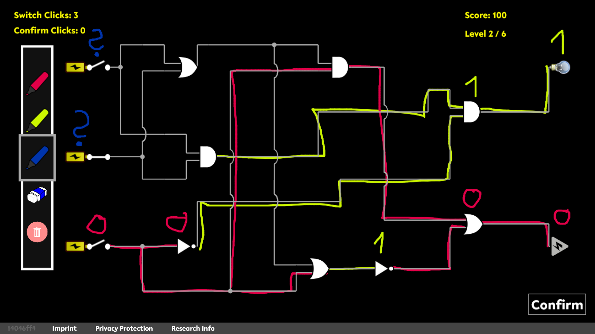

# ReverSim
[](https://beta.hrestudy.com) 
[](https://doi.org/10.1145/3706598.3714160) 

ReverSim is an open-source environment for the browser, originally developed at the 
[Max Planck Institute for Security and Privacy (MPI-SP)](https://www.mpi-sp.org/)
to study human aspects in hardware reverse engineering.



## Getting Started
You can try out ReverSim on our public demo instance at [beta.hrestudy.com](https://beta.hrestudy.com/index) 

To customize the sequence of tasks, change game rules, or to collect data for your own research, you will have to install the game on your own hardware.\
We provide three ways to install and run the ReverSim server: 

1. With [Docker](https://www.docker.com/) (preferred for production use): `docker run -it -p 8000:8000 ghcr.io/emsec/reversim:latest`
2. With the [VS Code](https://code.visualstudio.com/) Python debugger (for testing only)
3. From the command prompt (alternative)

You can find out more in our [getting started guide](doc/GettingStarted.md).

For information on how to use the level editor, see [doc/LevelEditor.md](doc/LevelEditor.md).

## Academic Research
If you would like to use ReverSim for academic research, please feel free to get in touch with us – we are happy to assist with setup!

In your publication, please cite our paper as follows:
```latex
@inproceedings{2025:Becker:ReverSim,
	title        = {{ReverSim:} {A} Game-Based Environment to Study Human Aspects in Hardware Reverse Engineering},
	shorttitle   = {{ReverSim}},
	author       = {Steffen Becker and Ren{\'{e}} Walendy and Markus Weber and Carina Wiesen and Nikol Rummel and Christof Paar},
	year         = 2025,
	booktitle    = {Proceedings of the 2025 CHI Conference on Human Factors in Computing Systems},
	location     = {Yokohama, Japan},
	publisher    = {{ACM}},
	address      = {New York, NY, USA},
	series       = {CHI '25},
	doi          = {10.1145/3706598.3714160},
	url          = {https://doi.org/10.1145/3706598.3714160}
}
```

## Licensing
The ReverSim source code and level library are licensed under the GNU Affero General Public License, Version 3 (AGPL-3.0).
Please refer to the license file for further information.

## Contributing
Third-party contributions to the source code and the [Level Library](https://github.com/emsec/reversim-circuits) are highly encouraged.
