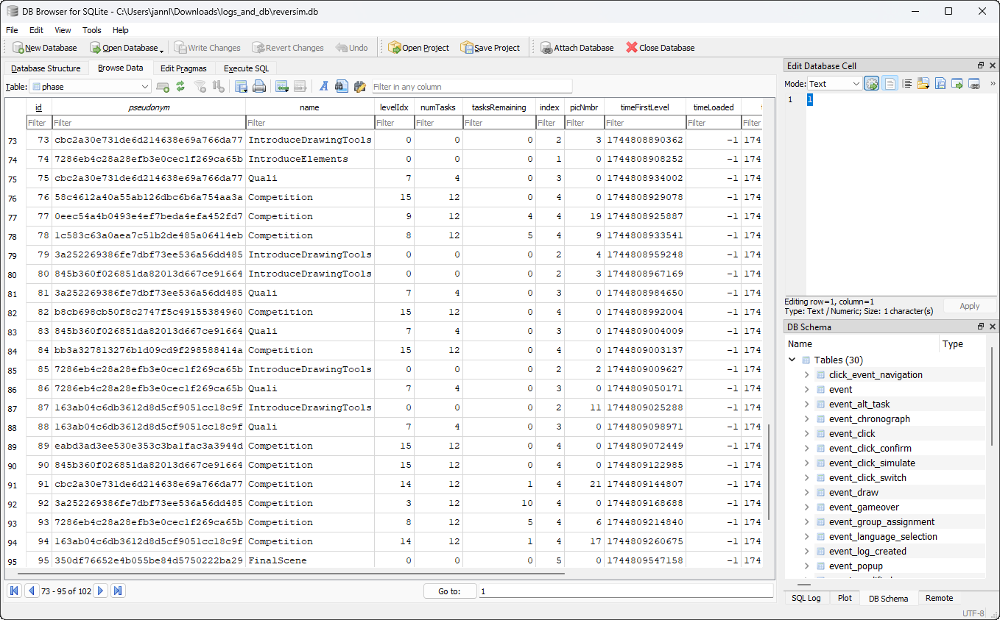

> [!NOTE]\
> This document is splitted into a [User Guide](#database-user-guide) and a [Developer Guide](#database-developer-guide). \
> If this documentation does not explain everything you need to know, feel free to [contact us](GettingStarted.md#your-feedback).

# Database User Guide
To store the state of every player on disk and to create logs for statistical analysis, a database is used to persist this information between server restarts. 
We decided to use SQLite for this purpose, as there are no complicated setup steps for this database. The entire database is stored inside a single file inside the instance folder: [{instance}/statistics/reversim.db](#).

A (relational) database is structured a bit like an Excel Document. You have multiple tables, which correlate to separate Excel sheets. The tables are then structured like you would expect: the table head describes what content is stored in which column, and every database entry correlates to a single row.
During runtime new rows can be created, read, updated or deleted (CRUD), but the layout of the tables will usually stay the same (schema).
Every row must have an unique identifier (a column which usually contains an ascending number) called a primary key. This key can be used to link between entries in different tables.

## Database upgrades
When you update the ReverSim application (e.g. with `git pull` or `docker pull`), the source code will be updated, but sometimes the database will no longer be compatible with the source code, e.g. when a new column was introduced which would be missing in the database.

But fear not, you can keep all your data and migrate it to the newest version. When you use our [docker-compose.yml](/docker-compose.yml) file, you do not need to do anything, since the Container will check for new updates and upgrades your database automatically.

But in all other cases you will need to perform this update yourself. Just run the following command from the root of the ReverSim repository (please make sure that your server is stopped before running the command):

```bash
$ flask --app gameServer db upgrade
```

The startup will look similar to a regular start, but there should be some messages from Alembic telling you what upgrade steps have been performed. The application should then exit without any errors. You can restart your server normally afterwards.

> [!WARNING]\
> There is also a `downgrade` command. But this operation is destructive and will cause **data loss**, so please refrain from using it! The `upgrade` command is safe however, as we will design the upgrade tasks to be non destructive.

## Database Location
The instance folder will be at the the following location:
- When using our Docker-Compose file: The [statistics/](#) folder is stored in the volume `reversim_playerdata`, which you can mount in a different container to inspect/copy to a different machine
- When launching from VS Code: [{YOUR_WORKSPACE}/instance/statistics/reversim.db](../instance/statistics/reversim.db)
- If none of the above: Check the beginning of your server log or the contents of the `REVERSIM_INSTANCE` environment variable.


## Access your data
> [!NOTE]\
> If you need a high level overview over the participant data, we also provide our statistics tool, which will read the database and produces a csv file with one row per participant containing e.g. the time a player took to solve the level or the number of switch clicks. You can find the relevant documentation under [doc/StatisticsTool.md](StatisticsTool.md).
> 
> The following section is only relevant, when:
> - You have a research questions that can not be answered with our statistics tool
> - You are troubleshooting
> - Or when you are curious how the internal structure looks like

There are many tools out there to inspect the content of an SQLite database. We can recommend [DB Browser for SQLite](https://sqlitebrowser.org/), as the user interface is quite intuitive even for non technical users, but it also offers features for advanced users like running SQL statements.



But if you are a technical user you might also like the [SQLTools](https://marketplace.visualstudio.com/items?itemName=mtxr.sqltools) extension for VS Code.


### Sample Queries
Here are some sample queries you can perform on the database:

```sql
-- Get the statistics, how many players started/finished each group
SELECT * FROM group_stats

-- Select Timer Events
SELECT * FROM event JOIN event_chronograph ON event.id == event_chronograph.id

-- Select click events
SELECT * FROM event JOIN event_click ON event.id == event_click.id

-- Select all level states
SELECT * FROM event JOIN level_state ON event.id == level_state.levelEvent_id

-- Select all PopUps and filter out the close event
SELECT * FROM event JOIN event_popup ON event.id == event_popup.id WHERE action==1

-- Select all Draw Tool select events
SELECT * FROM event JOIN event_select_draw ON event.id == event_select_draw.id JOIN event_click ON event.id == event_click.id

-- Select a certain time range (the format matters, e.g. there shall be no "T" between the date & time)
SELECT * FROM event WHERE timeServer BETWEEN '2025-04-16 13:05:40' AND '2025-04-16 13:05:43'
```


# Database Developer Guide
> [!NOTE]\
> If you are an end user, you can most likely ignore this section, as database upgrades are probably provided to you. However if you are a developer and made changes to the schema of the ORM/database, go ahead:

We have decided to use SQLite as our database, which is a rather uncommon choice for a web application that might need to scale. However in our usecase we do not expect hundreds of players at the same time, therefore we can get away with a database that fully locks during a write transaction and therefore only allows a single writer at the same time. 
A single writes however doesn't mean, that only a single player can play the game, as the write-locks only occur during a transaction which are designed to be as short as possible. If two players would manage to click lets say the confirm button at exactly the same time, the second player will be processed after the transaction of the first player ends, which usually only takes a couple of milliseconds.

The following reasons influenced our decision towards SQlite: You do not need to setup a separate database server, as the database is only a single file which gets directly accessed by the Python database server. Since our primary objective is to do research with the game, this file can easily be shared with all researchers for offline analysis and you do not need to administrate separate database user accounts for your researchers.

We have decided against enabling [Write Ahead Logging (WAL mode)](https://www.sqlite.org/wal.html), as this introduces two additional files. We would also not benefit from the performance improvements that much, since we start all [transactions](https://www.sqlite.org/lang_transaction.html) with `BEGIN EXCLUSIVE`, which is SQLites way of implementing a [serializable isolation level](https://en.wikipedia.org/wiki/Isolation_(database_systems)#Serializable). The EXCLUSIVE mode prevents ongoing read transactions from getting kicked with an SQLITE_BUSY error by a write transaction and minimizes the chances for a race condition bug.

If you wish to use a different Database technology like e.g. Postgres, you will probably only need to exchange the database URI for your server and disable the [SQLITE_HACKS in database.py](#pysqlite-driver-issues), as most implementation details of different database drivers are abstracted away by SQLAlchemy. However you will enter unchartered territory as we have never tested a different database driver with our game.


- All datetime strings and timestamps are in UTC
- NullPool is more robust against wsgi server implementations, that use multiprocessing / os.fork https://docs.sqlalchemy.org/en/20/core/pooling.html#using-connection-pools-with-multiprocessing-or-os-fork
- But it comes with a performance penalty, therefore we use the static pool and have to make sure, that a connection is not forked to the child process.

## Creating database upgrade files
> Alembic can view the status of the database (pointed to by `SQLALCHEMY_DATABASE_URI` in your `Flask.config` using the current schema) and compare against the table metadata in the application (your ORM which defines the proposed schema), generating the “obvious” migrations based on a comparison. This is achieved using the --autogenerate option to the alembic revision command, which places so-called candidate migrations into our new migrations file. We review and modify these by hand as needed, then proceed normally.

https://alembic.sqlalchemy.org/en/latest/autogenerate.html

To create a new database revision, you just have to call the following command:

```bash
flask --app gameServer db revision "YOUR SHORT CHANGELOG"
```

Afterwards you always have to manually inspect the generated Python script inside the [migrations/](../migrations/) folder. Because the autogenerate feature is unable to [detect all changes](https://alembic.sqlalchemy.org/en/latest/autogenerate.html#what-does-autogenerate-detect-and-what-does-it-not-detect) and might make mistakes (e.g. for SQLite you have to add the `server_default="..."` parameter to columns which are not nullable). Afterwards check that your script works by running the upgrade at least once and test that no exceptions occur while playing the game (like missing columns etc.). You should also [inspect the database](#access-your-data) with the tool of your choice.

It is a good idea, to backup your database before you do the upgrade, in case you made a mistake!

---
[Alembic upgrade problematic due to SQLite design](https://alembic.sqlalchemy.org/en/latest/batch.html). However you do not have to worry as this inconvenience is abstracted away by Alembic.

- https://alembic.sqlalchemy.org/en/latest/tutorial.html#running-our-second-migration
- https://flask-alembic.readthedocs.io/en/latest/use/


## Change Version Tag of Database
If you want to change the version number of the database without running any up or downgrades, you can use the `stamp` command. The current version of the database is usually stored in the table `alembic_version`. In case it is missing, this command can be used to fix this. Keep in mind, that Alembic has no way of telling, if the Database schema actually matches the revision you specified.

```bash
flask --app gameServer db stamp XXXXXXX
```

<!-- NOTE Not true for Flask-Alembic as the id is a timestamp...: You don't have to type out the whole id of the revision, only enough so that Alembic can uniquely identify the revision. If the id is not unique, Alembic will complain. You can also use `base` to remove all revisions from the table or `heads` to mark the table as being at the most recent version. -->

## Downgrade
To downgrade to an older version, you can use the following command, however depending on the use case if you just need to change the current version of the database, it is probably better to just change the version with the [stamp command](#change-version-tag-of-database), as downgrades will most likely `DROP` (delete) columns, which can not be undone!

> [!WARNING]\
> The downgrade is destructive and will cause **data loss**!

```bash
$ flask --app gameServer db downgrade
```


## Pysqlite driver issues
> The pysqlite DBAPI driver has several long-standing bugs which impact the correctness of its transactional behavior. In its default mode of operation, SQLite features such as SERIALIZABLE isolation, transactional DDL, and SAVEPOINT support are non-functional, and in order to use these features, workarounds must be taken.
>
> The issue is essentially that the driver attempts to second-guess the user’s intent, failing to start transactions and sometimes ending them prematurely, in an effort to minimize the SQLite databases’s file locking behavior, even though SQLite itself uses “shared” locks for read-only activities.

https://docs.sqlalchemy.org/en/20/dialects/sqlite.html#serializable-isolation-savepoints-transactional-ddl

In theory, this issues was fixed with Python 3.12 by implementing the PEP 249 standard. However the [SQLAlchemy documentation](https://docs.sqlalchemy.org/en/20/dialects/sqlite.html#serializable-isolation-savepoints-transactional-ddl) has not fully caught up yet, they still mention it as unresolved and recommend the old fix (as of 2025-06-04). 
And there is a second reason we stuck to the old workaround: We need the SQLite transactions to be in `BEGIN EXCLUSIVE` mode and we haven't found a way yet to achieve this with the PEP 249 compliant implementation. Because in theory you should be able to set `connection.autocommit = False` and `connection.isolation_level = "EXCLUSIVE"`. But the `isolation_level` gets ignored if `autocommit` is not set to `sqlite3.LEGACY_TRANSACTION_CONTROL`, which would be the old broken behavior.
<!-- TODO: Open a discussion in the pysqlite bugtracker -->

If you wish to disable the workarounds we implemented to cope with the default behavior of pysqlite, you can set `SQLITE_HACKS = False` in [database.py](../app/storage/database.py).


### Further reading
| Python Bugtracker (Deprecated)     | GitHub Bugtracker                              |
| ---------------------------------- | ---------------------------------------------- |
| https://bugs.python.org/issue9924  | https://github.com/python/cpython/issues/54133 |
| https://bugs.python.org/issue10740 | https://github.com/python/cpython/issues/54949 |
| https://bugs.python.org/issue39457 | https://github.com/python/cpython/issues/83638 |


TLDR:
> - [gh-83638: Add sqlite3.Connection.autocommit for PEP 249 compliant behaviour #93823](https://github.com/python/cpython/pull/93823) introduces `autocommit` as a parameter to `connect()` and as an attribute to `Connection`
> - the current (3.11) behaviour is still the default behaviour
> - `isolation_level` is _not_ deprecated

https://docs.python.org/3.12/library/sqlite3.html#transaction-control
