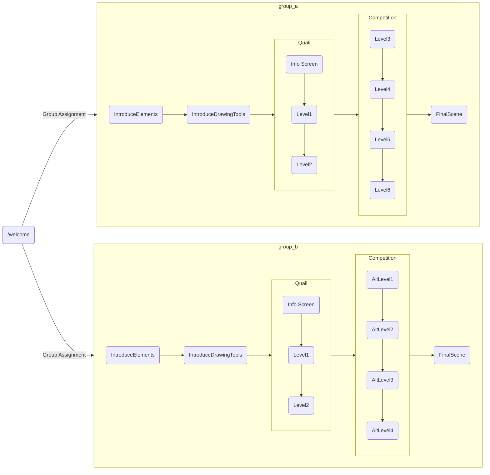

# Getting Started with the ReverSim Game
In this quick start guide, you will learn how to install ReverSim and how to play it on your local instance for the first time. Afterwards, we will guide you through the level creation process and how you can configure the game to suit your needs. 

Due to the versatile configuration options, this guide only gives you a high-level overview and links to relevant parts of the documentation where it is required. When reading this guide for the first time, it is highly recommended to ignore most of the cross-references so you don't get lost during the setup process.

This guide will only teach you how to set up the game server. [Data analysis](StatisticsTool.md) is out of the scope for this quick start guide.

The following four steps should get you up and running. If you are struggling, feel free to [contact us](#your-feedback):

<!-- TODO Maybe document OOB experience (delivered groups & levels) -->

1. [Installation](#1-installation)
2. [Setting Up Your Groups](#2-game-setup)
3. [Creating Levels](#3-level-creation)
4. [Research Info, Translation, etc.](#4-additional-config)
5. [Your Feedback](#your-feedback)

## 1. Installation
There are three main methods for obtaining a running version of the game. Choose the one which suits your needs:

1. [Docker Installation](#docker-installation): The easiest method to evaluate the game, if you are already familiar with Docker (Also the recommended way to go for production use).
2. [VS Code](#developing-with-vs-code): During development, the recommended variant is using Visual Studio Code, as this can automatically restart the web server upon changes and allows you to step through your code with the debugger.
3. [Manual Installation](#manual-installation): The way to go for a minimal installation. You just need Python and one package from Pip.

### Docker Installation
1. If you haven't already, you must install Docker first. If you are using Windows or macOS or if you prefer a graphical user interface, follow the installation instructions for [Docker Desktop](https://docs.docker.com/get-docker/). If you use Linux and just require the Docker commands, go with [Docker Engine](https://docs.docker.com/engine/install/).
2. Open up a command prompt to download and launch the ReverSim container (alternatively, we also provide a [compose file](#docker-compose)):
```sh
#docker pull "docker.io/library/reversim:latest"
docker run -d -p 8000:8000 -v reversim_playerdata:/usr/var/reversim-instance/statistics reversim:latest

# -d --daemon	Run in the background
# -p --publish	Forward the port of the web server
# -v --volume	Create a named volume for the player logs
```
3. Open up your favorite web browser and you are ready to go. Just navigate to the IP address of your Docker machine, if this is your local computer, head over to [127.0.0.1:8000/index](http://127.0.0.1:8000/index).

> [!TIP]\
> The game server should be fully functional by now and you can proceed with ["Level Creation"](#3-level-creation). 
> The following paragraphs only provide additional information on configuring the web server, especially for production.

<!--But keep in mind, that your player logs are currently only stored in an anonymous volume, which could get pruned by accident when the container is stopped.-->

#### Docker Compose
There is a lot to configure for the Docker container. While you could add every option to the `docker run` command, it doesn't really help with readability. Therefore, we recommend using a Dockerfile.

We ship an example [docker-compose.yml](/docker-compose.yml) with this repository that you can simply use by calling:

```sh
docker volume create reversim_playerdata
docker compose up --detach --force-recreate
```

Feel free to tweak this file to suit your needs. For example you can add resource limits to this container. See the [Docker Compose Documentation](https://docs.docker.com/compose/) for further reference.


### Developing with VS Code
1. Make sure you have a recent installation of [Python3](https://www.python.org/downloads/), [git](https://git-scm.com/) and [Visual Studio Code](https://code.visualstudio.com/download).
2. Navigate to a folder that you would like to use as a workspace and clone the ReverSim repository: `git clone https://github.com/emsec/ReverSim.git`
4. Open the folder in Visual Studio Code
4. Install the necessary Python dependencies with `pip install -r requirementsDev.txt`. It is recommended to create a [Python Virtual Environment](#creating-a-python-environment), especially when running on Linux/UNIX, to prevent conflict with system packages.
5. Afterwards, you can start the server: In the left sidebar, open the _Run and Debug_ (Ctrl + Shift + D) tab in VS Code, select the "Python: Flask" launch target and click launch (the green triangle)
6. To view/play the game, you can either start the "*Firefox Debugger*" launch target if you have Firefox installed, or you can open a web browser and navigate to [localhost:8000/index](http://localhost:8000/index) or [localhost:8000/welcome](http://localhost:8000/welcome)

The Flask development server should restart automatically when you modify the Python files and remove the `--no-reload` flag in launch.json. Changes to the templates might need a manual server restart. If you make changes to the frontend, you just need to reload the page.

> [!WARNING]\
> **Never** connect the [Flask development server](https://flask.palletsprojects.com/en/3.0.x/deploying/) you just launched to the open internet, as it is **insecure** by design! Use the [Docker](#docker-installation) container or follow the [manual installation for production](#production-use) procedure. But if you are just testing things with your team locally, you can now scroll to ["Level Creation"](#3-level-creation).

### Manual Installation
1. Install a recent version of Python3 
2. If you have git installed, use it to [clone](#cloning-the-git-repo) the repository. But you can also download a ZIP archive from the _Releases_ Page. Then point your command prompt into the folder was just created.
3. If you are using Linux/UNIX, other system packages might also use Python. Therefore, creating a [Python Environment](#creating-a-python-environment) is recommended.
4. If you want to test things locally, using the built-in Flask web server is fine. Install and launch it by running the following two commands:

```bash
pip install -r requirementsDev.txt
python -m flask --app gameServer run -p 8000
```

5. Open the following URL in your browser: [127.0.0.1:8000](http://127.0.0.1:8000)

> [!WARNING]\
> **Never** connect the [Flask development server](https://flask.palletsprojects.com/en/3.0.x/deploying/) you just launched to the open internet, as it is **insecure** by design! Use the [Docker](#docker-installation) container or follow the [manual installation for production](#production-use) procedure. But if you are just testing things with your team locally, you can scroll to ["Level Creation"](#3-level-creation).

<!--
> ![TIP]
> You should now be able to play the game by navigating to [127.0.0.1:8000]() (Change the IP address if you installed the server on a remote machine). You can now scroll to "Level Creation" to continue with the [next installation step](#level-creation). 
> However, you might want to come back later to tweak some installation-specific settings.
-->

#### Production Use
The above installation will suffice for a quick test, but the Flask built-in web server is not meant to be used in production. There are several web servers out there that offer better security and performance. Due to the WSGI standard, you can interchange them easily and have a couple of [options to choose](https://flask.palletsprojects.com/en/3.0.x/deploying/#self-hosted-options) from. We decided to go with uWSGI, which also powers the Docker container. 

```bash
# Install dependencies
pip install -r requirements.txt

# Run the web server
uwsgi --ini conf/hre_game.ini
```

If you get stuck while configuring your server, you can always have a look at the default config under [instance/conf/gameConfig.json](/instance/conf/gameConfig.json).

> [!NOTE]\
> The compilation of uWSGI tends to fail on Windows, so you might need to search for [alternatives](https://flask.palletsprojects.com/en/3.0.x/deploying/#self-hosted-options) to uWSGI if you are using a Windows machine as a server.


## 2. Game setup
> [!TIP]\
> Before you configure anything, test the game to make sure that your installation succeeded. Go to [localhost:8000](http://localhost:8000)

You can host different study settings on a single server, showing different levels & phases to different groups of players. This assignment can either happen:
1. Automatically: The player will be assigned to the group with the lowest player count.
2. Manually: Either you give the players a dedicated link or let them choose their group with the group index page [YOUR_HOSTNAME:PORT/index](/index) (the index page must be [enabled in the gameConfig](GameConfig.md#groupindex)).

_But what exactly is a phase, I hear you ask?_ [Phases](#phase) are the fundamental building block of the game, and they will contain certain parts of the game, like an introduction, or often times a [list of levels](#3-level-creation) with some additional game logic. The player will progress through the phases in a mostly linear fashion. However, there are some exceptions (Quali and Skill). Below is a flowchart showing the automatic assignment and progression of two players through two sample groups:



The following table shows all scenes that you can use to build the game:

| Name                  | Description                                                        |
| --------------------- | ------------------------------------------------------------------ |
| IntroduceElements     | Introduce all logic gates and circuit parts to the player          |
| IntroduceDrawingTools | Ask the player to familiarize themselves with the drawing tools    |
| Quali                 | The player needs to pass these levels, in order to proceed to the next phase. If there are too many mistakes, the player will be thrown back to `IntroduceElements` |
| Competition           | The main game phase where the player will play the study relevant levels |
| Skill            | Switch to a different group after this phase depending on how well the player performed while solving the levels |
| Alternative           | Present some [HTML-based task or info](AltTask.md) to the player                 |
| FinalScene            | Thank the player for participating and redirect to post-survey if [configured](GameConfig.md#urlpostsurvey) |

We will first focus on the basic game setup and how you can create 

To create your study settings, have a look at [instance/conf/gameConfig.json](GameConfig.md). This file is structured in three main sections, as illustrated in the below example:

```jsonc
{
	// Global config options affecting the whole instance (below are some examples)
	"assetPath": "conf/assets",
	"languages": ["en", "de"],
	"author": "Your Institution",
	"crashReportLevel": 2,
	"groupIndex": {
		"enabled": true
	},
	"footer": {
		"researchInfo": "assets/researchInfo/researchInfo.html"
	},

	// Gamerules are blocks of config entries applied to a group.
	// Each group will have exactly one gamerule (you can use a gamerule
	// for multiple groups)
	"gamerules": {
		"rules_a": {"...": "..."},
		"rules_b": {"...": "..."}
	},

	// And the groups themselves. 
	"groups": {
		"group_a": {
			"config": "rules_a",
			"...": "..."
		},
		"group_b": {
			"config": "rules_b",
			"...": "..."
		}
	}
}
```

> [!NOTE]\
> You can't use comments in the actual gameConfig.json file because they are unsupported by the JSON parser.

### Global Game Options
In the following, the three main sections of the configuration file are described in detail. These settings apply to the entire instance of the game:
```jsonc
"assetPath": "conf/assets",
"languages": ["en", "de"],
"author": "Your Institution",
"crashReportLevel": 2,
"groupIndex": {
	"enabled": true
},
"footer": {
	"researchInfo": "assets/researchInfo/researchInfo.html"
},
```

- `assetPath`: The path for levels, researchInfo or anything else that you can customize. If you see `${assetPath}` somewhere in the documentation, you know that this will be replaced by the value you just configured. By default this points into the folder with our example levels etc.. You can add your own content here. 
- `languages`: The first entry in this list will be the default language. The other languages will be shown in the language switcher on the start screen. German and English are the only options out of the box. If you need more, you must [translate](Translating.md) the game yourself.
- `author`: The name of your institution. It will be set in the `<head>` and [footer](#footer-groupindex) of the game.
- `crashReportLevel`: `2` means browser-side exceptions and `console.error` calls will be sent to the server and are logged. `1` means only exceptions that escape into the browser context will be logged and `0` means no client error reporting. The logfiles will be saved at [statistics/crash_report.log](.).
- `groupIndex`: The groupIndex page [/index](/index) contains a link to start a game for every group.
- `footer`: Links for the footer that are shown at the bottom of the screen during the game.

`languages`, `crashReportLevel` and `groupIndex` are the only keys that are really required, but you will probably want to fill out at least the ones from the example above. See the [GameConfig Documentation](GameConfig.md#game-options) for a full list of game options.

### Gamerule
Gamerules contain settings that are relevant to all phases inside the group and can even be recycled for multiple groups. Settings that apply only to a single phase are configured in the [phase block](#phase).

Most settings in the gamerule have default values that we deem reasonable. Therefore, your gamerule might just be a pair of empty brackets. Here we demonstrate how to [add a survey](GameConfig.md#urlpresurvey) that will be shown before the game. For a full list of gamerules you can change, look at the [GameConfig documentation](GameConfig.md#gamerules).

```jsonc
"rules_a": {
	"urlPreSurvey": "/assets/testPresurvey.html?ui={ui}&lang={lang}"
}
```

### Group
After you have created your gamerules, you can assign them to one or more groups. The group will control the course of the study, aka the order in which the player traverses through the phases.

```jsonc
"group_a": {
	"ctr": 0,
	"config": "rules_a",
	"phases": ["IntroduceElements", "IntroduceDrawingTools", "Quali", "Competition", "FinalScene"],
	"Quali": {
		"shuffle": false,
		"levels": "levels_quali.txt"
	},
	"Competition": {
		"shuffle": true,
		"levels": "levels_study2_low.txt"
	}
},
```

- `ctr`: Will be added to the counter of players that finished the game. Set this to a very high number (e.g. 9999), to prevent players from getting automatically assigned to that group
- `config`: The name of the gamerule you created in the [previous step](#gamerule)
- `phases`: A list of all phases the player must complete in order. See the table [above](#2-game-setup) for a full list
- `Quali` / `Competition`: See the [next chapter](#phase)

#### Phase
You have now configured which phases are played in which order, but you will need to assign a [list of levels](#level-list) to the phases containing levels. 

```jsonc
	"...": "...",
	"Quali": {
		"shuffle": false,
		"levels": "levels_quali.txt"
	},
```

When you turn on the shuffle option, the levels are sent to the player in a random order. Everything that is not of type `level` will stay in place. 

See the [GameConfig documentation](GameConfig.md#quali--competition) for examples of every phase.

#### Level List
Level lists are just plain text files with one level file path per line. By grouping the levels in [level lists](LevelList.md), you don't clutter the gameConfig and you can reuse them for multiple groups. Below is an excerpt taken from the example Quali phase:
```yml
text: qualificationPhase_Start.txt
level: alow_00000001
level: blow_00001000_v2
level: clow_11111101
special: retut/voluntaryTutorial.txt
```

The level lists are stored under [${assetPath}/levels/](LevelList.md). As shown in the example, you can add more to these lists beyond just levels. Have a look at the [level list guide](LevelList.md) for further explanations.

> [!TIP]\
> We have provided some example levels, which you can add to your level list to test your configuration. You should make sure the game works before you create your [own levels](#3-level-creation).

## 3. Level Creation
Levels are the central game element, containing the logic circuits/netlists the player has to solve. 
The game ships with a collection of levels that we have created, which you can use to build your first study. 
But yon can also create levels on your own using the [level editor](./LevelEditor.md). An in-depth explanation is given in the level editor [documentation](./LevelEditor.md).

When you press save, the level will end up in your Downloads folder. Afterwards, you need to drop your levels inside the [${assetPath}/levels/differentComplexityLevels/](LevelList.md#file-paths) folder (when using Docker, this is probably inside a [volume](https://docs.docker.com/storage/#good-use-cases-for-volumes), have a look at the docker command or [compose file](#docker-compose)). You can use subfolders to organize the levels if you like.


## 4. Additional Config
### Research Info
Before going live, you should provide information about your research. This will be linked at the bottom of the game if [enabled in the config](GameConfig.md#research). By default, the path to the research info is [${assetPath}/researchInfo/researchInfo.html]() and can be any arbitrary HTML page. You can also [change](GameConfig.md#research) this to an existing URL of your website etc.

<!--
### Optional Config
-->

## Your Feedback
We would love to hear from you if you plan to use our game. Regardless of whether you're using it for your bachelor thesis, for your postdoctoral research, or in a classroom setting. If you're struggling to set up the game, please don't hesitate to contact us and we'll be happy to help.\
Just contact us using one of the methods below:

- reversim&#40;&#x61;&#x74;&#41;mpi-sp&#46;org &#9993;
- [GitHub Issue](https://github.com/emsec/ReverSim)

## Annex
### Cloning the Git Repo
```bash
git clone --recurse-submodules https://github.com/emsec/ReverSim.git
```

This guide assumes that VS Code and all command prompts are pointed inside the folder created by this command (except when using the pre-built Docker image).

### Creating a Python Environment
Make sure `venv` is installed and your command prompt is inside the ReverSim folder, then create a virtual environment with the following commands:
```bash
pip install venv
python -m venv .venv
```

The following steps differ from each other, depending on if you are using Windows or Linux as your operating system.

**Windows:** Activate this virtual environment by running the below commands in a PowerShell window inside the ReverSim folder:
```PowerShell
# You might need to change a policy to allow running custom scripts
Set-ExecutionPolicy -ExecutionPolicy RemoteSigned -Scope Process

# Activate the Python environment in the current PowerShell session
./.venv/Scripts/Activate.ps1
```

**Linux/UNIX:** run the below commands inside the ReverSim folder to activate the virtual environment:
```bash
# You might need to make the script executable before running
chmod +x .venv/Scripts/activate

# Activate the Python environment in the current Bash session
./.venv/Scripts/activate
```

### Skipping Levels
You can skip the element introduction by pressing [W] on your Keyboard. A skip button will show up in the top right corner.

And while in Quali, Competition or any other Phase with levels, you can use the command `cheat.skip()` from inside your browser console, to skip a level. (You can open the dev tools in Firefox by pressing [CTRL] + [Shift] + [I])
To view the solutions for a level, use the command `cheat.solve().correctSolutions`.

If you have set a high cooldown for incorrect confirm clicks, you can clamp it for testing with the following setting: `gamerules.wrongSolutionCooldownLimit = 5`

### Skipping the Presurvey
If you prefix your group with `debug` (e.g. `debugpaper` for the example config) the game will skip the presurvey and redirect you directly to the game.

### Managing your assets in a separate repository
- ENV: `REVERSIM_CONFIG="conf/gameConfig.json"`
- `assetPath`

==TODO==

### Common Issues
- Maybe add NOTE that levels are always persisted in a volume 
- Maybe mention that the port forward is done using [firewall NAT](https://docs.docker.com/network/packet-filtering-firewalls/)

==TODO==

### uWSGI Lifecycle
We are aware that the uWSGI repository is only in [maintenance mode](https://github.com/unbit/uwsgi/issues/2454). As long as security fixes and updates to new Python versions are coming in, we are not switching horses (or unicorns) yet.
