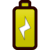
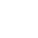

# Documentation HRE game level format
The levels for the Hardware Reverse Engineering game are stored in a custom format. 
Each line represents one [logic element](#element), [a connection](#connections) or a [level option](#config-options).

The files are UTF-8 encoded, if you wan't to change the encoding, you have to alter the `LEVEL_ENCODING` variables inside [app/config.py](/app/config.py) and [static/src/game.js](/static/src/game.js). However the [level editor](/README.md#hre-browser-game) will always produce UTF-8 files due to a limitation in the Blob API.

The level file name should either end with .txt or you can also omit the file ending entirely. 
The full filename is used internally, but in places like the logfiles the names are unified by removing the `.txt` suffix.
We discourage you from creating level files whose file names are only distinguished by their casing or file ending.

---

## Config options
### time
`time§0`

The maximum time in seconds, the player is expected to need for this level. After the time runs out, a skip button will be shown. This is done at a per level basis, to reflect the different solving times levels with varying complexity will have. This feature is currently not available in the level editor and has to be edited in the file manually.

---

## element
`element§{id}§{type}§{rotation}§{xpos}§{ypos}`

| Parameter | Possible values |
| -------------- | --------------- |
| `{id}` | A **unique** number starting from 0 |
| `{type}` | See the list below for all possible values |
| `{rotation}` | A number from 0 to 3, each increment of 1 will rotate the element 90° |
| `{xpos}` | A level coordinate ranging from 0 (left border) to level width (1250) |
| `{ypos}` | A level coordinate ranging from 0 (top border) to level height (700) |

**Possible values for `{type}`:**
- [VCC](#vcc)
- [GND](#gnd)
- [Inverter](#inverter)
- [AndGate](#andgate)
- [OrGate](#orgate)
- [Splitter](#splitter)
- [Switch](#switch)
- [DangerSign](#dangersign)
- [LightBulb](#lightbulb)
- [TextBox](#textbox)
- [CovertGate](#covertgate)
- ([Image](#image))

### VCC
`element§{id}§VCC§{rotation}§{xpos}§{ypos}`

One of the Input Elements. All wires and elements that are directly connected will receive a logical 1/HIGH on the input. This element has no input but an unlimited number of outputs.

### GND
`element§{id}§GND§{rotation}§{xpos}§{ypos}`

One of the Input Elements. All wires and elements that are directly connected will receive a logical 0/LOW on the input.
This element has no input but an unlimited number of outputs.

Please note that VCC and GND do not behave in a physically correct way, where current would flow between VCC and GND. In fact if you try to connect VCC and GND with a wire, the circuit will throw an error. The naming and icons with the full and empty battery are meant to communicate HIGH and LOW to the layman, but might leave some experts head scratching.

### Inverter
`element§{id}§Inverter§{rotation}§{xpos}§{ypos}`

One of the Logic gates. This gate has one input and will output the inverse of the input to all wires/elements connected to the output (output is LOW when Input is HIGH and vice versa).

### AndGate
`element§{id}§AndGate§{rotation}§{xpos}§{ypos}`

One of the Logic gates. This gate has multiple inputs and will only send HIGH to all wires/elements connected to the output, if all inputs are HIGH, otherwise all outputs will be low.

### OrGate
`element§{id}§OrGate§{rotation}§{xpos}§{ypos}`

One of the Logic gates. This gate has multiple inputs and will send HIGH to all wires/elements connected to the output, if at least one of the inputs is HIGH, the output will only be low if none of the inputs is HIGH.

### Splitter
`element§{id}§Splitter§{rotation}§{xpos}§{ypos}`

While you can connect multiple wires to the output of basically any element, it is not recommended for visual clarity. Instead use splitters to connect the output of an element to multiple inputs.
You can also use this element to guide the autorouter, when only one wire is connected to the output, the splitter will be hidden ingame.

This element will transparently feed the signal received on the only input to all wires/elements connected to the output.

### Switch
`element§{id}§Switch§{rotation}§{xpos}§{ypos}§{closed}`

The only way for the player to interact with the circuit. This element has only one input and will send HIGH to all connected wires/elements, if this input is HIGH and the switch is closed. If the switch is open or the input is LOW, all outputs will also be LOW.

| Parameter | Possible values |
| --------- | --------------- |
| `{closed}` | `true` if the switch is closed, `false` otherwise. TODO Third option is `random` |

`^element§([0-9]*)§Switch§[0-9]§[0-9]*§[0-9]*§random`

### DangerSign
`element§{id}§DangerSign§{rotation}§{xpos}§{ypos}`

One of two objectives in the game. This element only has one input and no outputs. The player has to interact with the switches to pull its input LOW in order to solve the level.

### LightBulb
`element§{id}§LightBulb§{rotation}§{xpos}§{ypos}`

One of two objectives in the game. This element only has one input and no outputs. The player has to interact with the switches to pull its input HIGH in order to solve the level.  
If the input of all LightBulbs is HIGH and the input of all DangerSigns is LOW, the level is solved.

### TextBox
`element§{id}§TextBox§{rotation}§{xpos}§{ypos}§{line1}§{line2}§{line...}`

Show some text to the player. There might be a way to use languageDict labels, but this feature is not understood/used yet.
The text will be centered around the given level coordinates, but is left justified.  
You can specify a line break by using the `§` character.

This element is only visually present and has no inputs/outputs. Connecting a [wire](#connections) to it will throw an error!

| Parameter | Possible values |
| --------- | --------------- |
| `{line1}` | Text |
| `{line2}` | Another line of Text (Optional) |
| `{line...}` | Another line of Text (Optional) |
| ... | ... |

### CovertGate
`element§{id}§CovertGate§{rotation}§{xpos}§{ypos}§{visualGate}§{actualGate}`

Obfuscated gates are additional hurdles for the player,
they come in two different flavors: 
- **Covert Gate**: While they look like a multi input gate (and/or), only one of their inputs is actually connected and the gate behaves like a wire/inverter. The other inputs are dummy inputs.
- **Camouflaged Gate**: The actual gate type is unknown the the person who is trying to reverse engineer the circuit.

The `{visualGate}` parameter will control the look of the gate (icon), but the actual behavior is controlled by `{actualGate}`. [AndGate](#andgate), [OrGate](#orgate) and [Inverter](#inverter) are explained above, identity means the gate basically behaves like a wire/[splitter](#splitter).

When `{actualGate}` is set to `inverter` or `identity` (aka covert gate), every [connection](#connection) will become a dummy wire, meaning they are only visually present and have no influence on the input state of this gate. You have to connect one [effectiveCovertGateConnection](#effectivecovertgateconnection) that will determine the input state (HIGH/LOW). The effectiveCovertGateConnection will also be rendered like a normal wire.

**Please note**: While the level editor might allow you to select combinations of values that are not listed in the following table, they won't depict reality and might lead to undefined behavior in the logic engine of the game. 
(Right now the logic engine only really cares about which one of the four `actualGate` values is selected and Phaser will display whatever image label is defined in `visualGate`. However these are implementation details and might change in the future)

| Parameter | Covert Gate (values) | Camouflaged Gate (values) |
| -------------- | --------------- | ------------------------- |
| `{visualGate}` | `and`, `or` | `camouflaged` |
| `{actualGate}` | `inverter`, `identity` | `and`, `or` |
| Dummy inputs? | Yes | No |

### Image
Not implemented yet

---

## connections
### connection
`connection§{elementID_1}§{elementID_2}§{elementID_...}`

These represent the wires that carry the signal/state from the output of one element to the input of at least one other element. Creating a loop will throw an error in the LevelEditor and crash the game in other scenes.

| Parameter | Possible values |
| -------------- | --------------- |
| `{elementID_1}` | The id of any element whose output will determine the input state (HIGH/LOW) of the connected elements |
| `{elementID_2}` | Connect to gate id |
| `{elementID_...}` | Additionally connect to gate id (Optional) |
| ... | ... |

### effectiveCovertGateConnection
`effectiveCovertGateConnection§{id of actual input}§{id of covertGate}`

Special case of wire that is needed for [CovertGate](#covertgate)s with an actual gate type of inverter or identity. This is the only situation where this kind of wire is needed and there needs to be exactly one covertWire connected to this kind of gate.

When you connect this to an actualGate of type AND or OR, right now it will behave like a normal wire.
Connecting a covertWire to anything that is not [CovertGate](#covertgate) will throw an error.

| Parameter | Possible values |
| -------------- | --------------- |
| `{id of actual input}` | The id of any element (logic gate, splitter, switch etc.) |
| `{id of covertGate}` | The id of a covertGate with `{actualGate}` set to `inverter` or `identity` |
