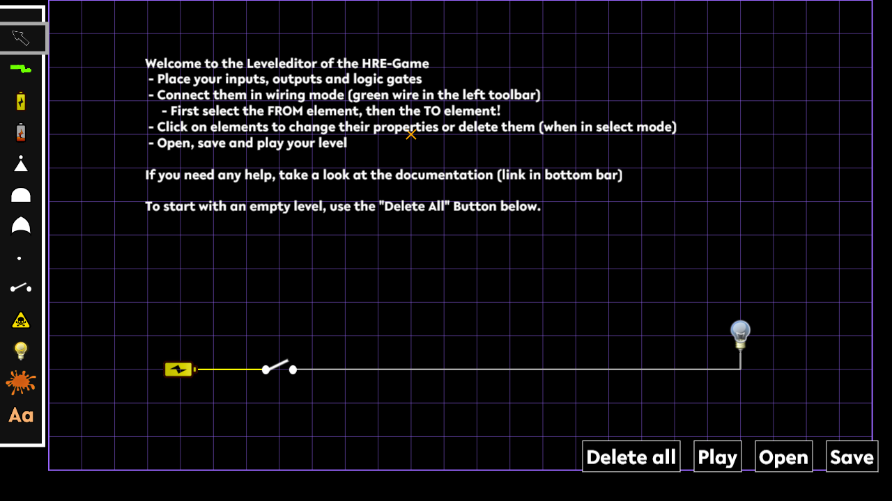

# Documentation Level Editor

> [!WARNING]\
> Only open files in the level editor, that you fully trust! The editor is not secured against malicious code inside the level files!

The level editor will give you a graphical way to create and modify the level files, which are presented by ReverSim.

The level editor provides all functionality required to design new study tasks. However, if you need to make advanced edits or you would like to write an external tool to generate levels, you can refer to our detailed [documentation about the level format](./Level.md).


## Opening the level editor
You can find the level editor by going to [/pre_survey?group=editor](/pre_survey?group=editor), if [enabled](#configuration).
In the Docker image the level editor is enabled by default. \
If the group index page is enabled inside [gameConfig.json](./GameConfig.md#enablegroupindex), you can also navigate to [/index](/index) and select the level editor at the bottom of the page.

You should then be greeted by a page that looks like this:




## Workflow
The general workflow is as follows, however the order here is not mandatory and you will probably need to iterate over earlier steps several times. For step 1 onwards we assume you have [opened the level editor](#opening-the-level-editor).

0. If you have a certain logic function in mind, it might help to use an external tool to generate a circuit, which you can then replicate inside the editor. We can recommend Logic Friday, it is no longer maintained but an [archived version](https://web.archive.org/web/20161222192144/http://sontrak.com/downloads.html) can be used. 
1. Open an already existing level from your local machine (if you want to edit a level on the server you have to download it first) or start from scratch by clicking the *Delete all* button in the bottom right corner
2. Place your components, this step becomes a lot easier if you can replicate the circuit generated by a different tool like Logic Friday. All components can be found in the left toolbar, first click on the desired component and then click the target locations on the grid:
	- Think of how many inputs your circuit should have and place the required number of switches (the player will need to interact with them)
	- Place the required number of power sources (the battery symbol). Usually you will need one full battery (logical 1/high) per switch, however you can also experiment with using both battery symbols as an input for the logic gates.
	- Place your logic gates: `and` & `or` gates will need at least two inputs (the recommended number is to use no more than two inputs, however the logic engine accepts more). `Inverter`s take only one input. 
	- Place the desired number of outputs. All light bulbs needs to be on (1/high) for the player to pass the level and all danger signs needs to be off (0, low).
	- You can modify properties like the rotation by entering select mode again (the arrow in the left toolbar) and clicking on a component. In this mode you can also move components around
	- To delete a component, click on it in select mode and press the delete button
	- See the chapter [Obfuscated Gates](#obfuscated-gates) if you plan on using CovertGates in your level.
3. Wire everything up:
	- Enter wiring mode by clicking the green wire tool from the left tool bar. You can leave it by clicking the arrow symbol which is located directly above.
	- In wiring mode, the autorouter is disabled and all connections are displayed as straight lines. This will help you if the autorouter fails due to an error.
	- Use splitters (the white dot in the left toolbar) if you need to connect several inputs to the single output of a logic gate. 
	- You can also use splitters to guide the autorouter, as all splitters with only one output will be hidden while playing the level.
	- In Wiring Mode you can delete a wire by either clicking on it and selecting delete in the pop up or by clicking the red circle with the black *x*.
4. Play the level at least once to make sure the level can be solved and everything looks as desired. The play button is in the bottom right corner. \
You can return to the editor by solving the level or by pressing the *Skip* button.
5. Save the level to your local machine by clicking the *Save* button. You then need to place it in the levels folder of your server/Docker machine. (The level editor is running on your local machine, the saved levels usually end up in your downloads folder. The level will not be send to the server on its own!)

> [!NOTE]\
> Please make sure to save your level before navigating to a different site or closing the tab/browser. While the editor tries to warn you when leaving the site, it is not guaranteed that your browser will display this warning to you. There is **no** automatic save feature at the moment and all progress will be lost if you leave the page!

## Obfuscated Gates
The intention of obfuscated gates is to complicate the process of reverse engineering the circuit. In this game they are modeled by either showing a different image to the player in case of covert gates, or they show an ink blob for camouflaged gates.

Both options are represented as an orange dab of paint in the left toolbar. You have to place them first and then switch back to select mode to open up the properties panel. 

You can not directly set the type to covert or camouflaged, but instead you configure the *visualGate* and *actualGate*. The visualGate determines the image that is shown to the player/person reverse engineering the circuit and the *actualGate* is how the game/silicon actually behaves. 
If you model reality, the only possible combinations for covert and camouflaged gates are as follows:

| Dropdown Menu | Covert Gate (values) | Camouflaged Gate (values) |
| -------------- | --------------- | ------------------------- |
| *visualGate* | `and`, `or` | `camouflaged` |
| *actualGate* | `inverter`, `identity` | `and`, `or` |
| [Dummy inputs?](#dummy-inputs) | Yes | No |

For technical details see the [level file documentation](Level.md).

### Dummy Inputs
`identity` and `inverter` need an actual covert gate connection. This **one** wire will determine the input of the gate, 
all other connections are only visual and have no influence on the input state. You can switch a wire from a normal 
connection to an actual covert connection by selecting it in wire mode and clicking the *Make covert connection* button.
The wire will then switch from green to orange, indicating the changed connection type.

## Configuration
In order to use the level editor, the following two sections must exist inside the `gameConfig.json`. The level editor is enabled in the default config, to disable it simply remove the `"editor": {...}` block from the config.

Inside the `"gamerules"` block the following should be present:
```json
"configEditor": {
	"enableLogging": false,
	"disclaimer": null,
	"competitionShowSkipButton": "always",
	"wrongSolutionCooldown": 0,
	"phaseDifficulty": {
		"Competition": "EASY"
	}
}
```

Create this block inside `"groups"` if you want to enable the level editor, otherwise just remove it:
```json
"editor": {
	"ctr": 9000,
	"config": "configEditor",
	"phases": ["LevelEditor"]
}
```

See `gameConfig_example.json` and the [gameConfig documentation](GameConfig.md) for additional details. 

### Implementation details
The level editor is implemented as a regular group, which will show two scenes. One of them is the `LevelEditor` scene which needs to be configured in the gameConfig.json as shown above. \
When you press the play button, the client will create a `Competition` scene with only one local level. After you solve or skip this level, the server responds with the `LevelEditor` scene again.